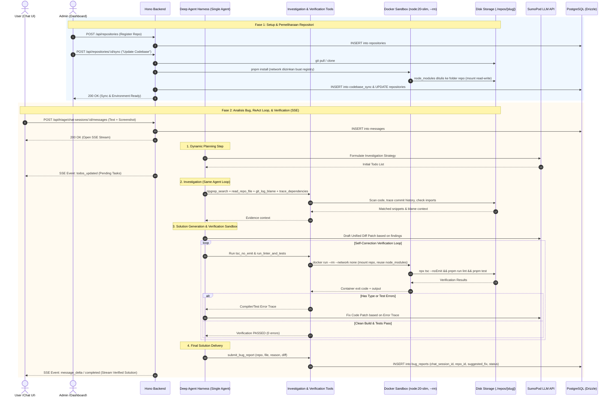

# Business Flow & System Architecture — Smart Bug Triage Deep Agent (Multi-Repo)

## 📌 Gambaran Umum Alur Bisnis (End-to-End Flow)

Sistem ini membagi alur kerja menjadi 2 fase utama:

### 1. Fase Setup & Pemeliharaan Repositori (Domain `repository`)
* **Admin** mendaftarkan repositori target (contoh: `frontend`, `backend`, `auth-service`) melalui Dashboard Admin (Nama, Slug, Remote Git URL, Branch, Local Directory Path).
* **Admin** menekan tombol **"Update Codebase & Environment"** (per-repo atau sync-all) untuk memicu proses `git clone` / `git pull` lokal di disk server VPS (`./repos/[slug]`), lalu instalasi dependensi (`pnpm install`) dijalankan **di dalam Docker sandbox** (container sekali-pakai, network diizinkan khusus buat install) - bukan langsung di host - biar postinstall script yang jahat dari repo target gak bisa nyentuh disk server.
* Timestamp `lastSyncedAt` dan log `codebase_sync` dicatat untuk memastikan keterbaruan data kode.

---

### 2. Fase Analisis Bug & Respon (Domain `triage` via Deep Agents Harness)

#### Diagram Arsitektur & Alur Kerja (Flowchart)

```mermaid
graph TD
    %% Subgraphs & Layers
    subgraph Frontend["Frontend Layer (Next.js 16 App Router)"]
        UI_User["Chat UI (User)<br/>- Submit Bug & Screenshot<br/>- Receive Realtime SSE Stream<br/>- View Dynamic Todo Progress"]
        UI_Admin["Admin Dashboard<br/>- Repo Management<br/>- Trigger Sync Codebase<br/>- View Verified Bug Reports"]
    end

    subgraph Backend_Repo["Domain: Repository (backend/src/domains/repository)"]
        RepoRoutes["repository.routes.ts<br/>(Admin Role Gated)"]
        RepoService["repository.service.ts"]
        GitEngine["infra/code-search/git.ts<br/>(simple-git)"]
    end

    subgraph Sandbox["Docker Sandbox (infra/verification/sandbox.ts)"]
        DockerRunner["node:20-slim container<br/>--rm, resource-limited<br/>--network none (kecuali install)"]
    end

    subgraph Storage_Disk["Server Local Disk"]
        ReposDisk["./repos/[slug]/<br/>Target Repositories Directory"]
    end

    subgraph Backend_Triage["Domain: Triage (backend/src/domains/triage)"]
        TriageRoutes["triage.routes.ts<br/>(SSE Stream Endpoints)"]
        TriageService["triage.service.ts<br/>(Deep Agents Runner & Checkpointer)"]
        
        subgraph DeepAgents["Deep Agent Harness (createDeepAgent)"]
            Planner["Task Planning (TodoListMiddleware)<br/>- write_todos Tool<br/>- Dynamic Step Progress"]
            
            subgraph ReActLoop["Autonomous ReAct Tool Loop"]
                MainAgent["Main Triage Agent<br/>(LLM Core, single-agent)"]
                
                subgraph ToolKit["Agent Toolkit (6 Tools)"]
                    T1["ripgrep_search<br/>(Multi-repo keyword scan)"]
                    T2["read_repo_file<br/>(Read code snippets/files)"]
                    T3["git_log_blame<br/>(Commit history & blame)"]
                    T4["trace_dependencies<br/>(Import/export references)"]
                    T5["tsc_no_emit ⭐<br/>(TypeScript Type Checker)"]
                    T6["run_linter_and_tests ⭐<br/>(ESLint & Unit Test Runner)"]
                    T7["submit_bug_report<br/>(Save verified fix)"]
                end
            end
        end
    end

    subgraph External_AI["External AI Gateway"]
        SumoPod["SumoPod LLM API<br/>(ChatOpenAI via @langchain/openai)"]
    end

    subgraph Database["Database (PostgreSQL + Drizzle ORM)"]
        DB_Repo["repositories & codebase_sync"]
        DB_Triage["chat_sessions, messages, bug_reports"]
        DB_Checkpointer["LangGraph Postgres Checkpointer"]
    end

    %% Relationships - Admin Flow
    UI_Admin -->|"POST /api/repositories/sync"| RepoRoutes
    RepoRoutes --> RepoService
    RepoService --> GitEngine
    GitEngine -->|"git clone / pull"| ReposDisk
    RepoService -->|"pnpm install (sandboxed)"| DockerRunner
    DockerRunner -->|"network diizinkan buat registry"| ReposDisk
    RepoService -->|"Record lastSyncedAt & Log"| DB_Repo

    %% Relationships - User Flow
    UI_User -->|"POST /api/triage/chat-sessions (SSE)"| TriageRoutes
    TriageRoutes --> TriageService
    TriageService <-->|"Load/Save Session State"| DB_Checkpointer
    TriageService --> MainAgent

    %% Deep Agent Executions
    MainAgent <-->|"Generate / Update Todos"| Planner
    MainAgent <-->|"Query AI Gateway"| SumoPod
    
    %% Tool Executions
    ReActLoop -->|"Execute Search / Read / Blame"| T1 & T2 & T3 & T4
    T1 & T2 & T3 & T4 --> ReposDisk
    
    %% Verification Feedback Loop
    ReActLoop -->|"Verification Sandbox"| T5 & T6
    T5 & T6 -->|"Run tsc & tests (--network none)"| DockerRunner
    DockerRunner --> ReposDisk
    T5 & T6 -.->|"Return Errors for Auto-Correction"| MainAgent

    %% Output Handlers
    ReActLoop --> T7
    T7 -->|"INSERT bug_reports"| DB_Triage
    TriageRoutes -.->|"Stream SSE Progress, Todos & Solution"| UI_User
    UI_Admin -->|"View Verified Bug Reports"| DB_Triage
```

#### Diagram Urutan Interaksi End-to-End (Sequence Diagram)

---

## 🛠️ Tech Stack & Keputusan Arsitektur

- **Monorepo Structure**: Menggunakan scaffold "Restack Pattern" — Next.js 16 (App Router) + Hono + Drizzle ORM + PostgreSQL + Zod (`@restack/shared`), pnpm workspaces.
- **Pemisahan Domain (Semi-DDD)**:
  - `backend/src/domains/repository/`: Khusus mengelola aset data repositori (`repositoriesTable`) dan log pemeliharaan (`codebaseSyncTable`).
  - `backend/src/domains/triage/`: Khusus mengelola sesi percakapan bug triage (`chatSessionsTable`, `messagesTable`) serta draf laporan bug terverifikasi (`bugReportsTable`).
- **Deep Agent Engine (`createDeepAgent`)**:
  - Menggunakan kerangka agentik **Deep Agents** berbasis `@langchain/langgraph`.
  - **TodoListMiddleware**: Menyajikan *real-time progress updates* (To-Do List) kepada pengguna via Server-Sent Events (SSE).
  - **Single-Agent ReAct Loop**: Satu agent utama memegang seluruh 6 tools (investigasi + verifikasi) dalam satu loop yang sama — tanpa delegasi ke sub-agent terpisah, biar hasil investigasi tetap ada di context yang sama saat drafting & verifikasi patch. Sub-agent baru dipertimbangkan lagi kalau tool-output investigasi mulai membengkakkan context.
  - **Postgres Checkpointer**: Mempertahankan konteks percakapan secara *stateful* berdasar `chatSessionId`.
- **7 Integrated Agent Tools**:
  1. `ripgrep_search`: Pencarian cepat kata kunci di disk `./repos/[slug]`.
  2. `read_repo_file`: Membaca file spesifik dan rentang baris kode.
  3. `git_log_blame`: Melacak histori komit (`git log`) dan regresi kode (`git blame`).
  4. `trace_dependencies`: Melacak rantai `import`/`export` antar file.
  5. `tsc_no_emit` ⭐: Verifikasi 0 error tipe data & syntax TypeScript (`npx tsc --noEmit`).
  6. `run_linter_and_tests` ⭐: Verifikasi linter dan unit test pass 100%.
  7. `submit_bug_report`: Menyimpan hasil akhir triage (repo, file, root cause, diff) ke `bug_reports` setelah verifikasi lolos.
- **Docker Sandbox untuk Install & Verifikasi**: `pnpm install` (saat sync) dan eksekusi `tsc_no_emit`/`run_linter_and_tests` (saat triage) dijalankan di dalam container Docker sekali-pakai (`node:20-slim`, `--rm`) yang cuma di-mount folder repo terkait - bukan langsung di host. Install diizinkan akses network (wajib buat registry npm), tapi eksekusi verifikasi jalan dengan `--network none` plus limit CPU/memory/pids, jadi kalaupun ada dependency/postinstall script yang jahat, dia gak bisa nyentuh disk server atau exfiltrate data keluar container. git clone/pull sendiri tetap jalan langsung di host (repo tetap ada di `./repos/[slug]/` seperti biasa, gak disimpan di Docker volume) - cuma eksekusi kode-nya yang di-container.
- **Verification & Self-Correction Feedback Loop**: AI Agent tidak secara pasif menyerahkan saran kode, melainkan mengeksekusi kompilator/test runner di dalam Docker sandbox tadi. Jika terdapat kesalahan kompilasi, AI Agent akan secara otomatis membaca *stack trace* error dan merevisi kodenya hingga bersih dari error sebelum ditampilkan ke pengguna.
- **Real-Time Streaming**: Menggunakan Server-Sent Events (SSE) dari Hono untuk menampilkan To-Do list, progres tools, dan draf perbaikan secara *real-time*.
- **LLM Gateway Provider**: Menggunakan [SumoPod](https://sumopod.com) (`https://ai.sumopod.com/v1`) via `@langchain/openai`'s `ChatOpenAI`.
- **Role & Access Control**: Pengguna memiliki 2 level akses: `user` (dapat membuat sesi chat bug report) dan `admin` (akses manajemen repo & dashboard internal bug report).
