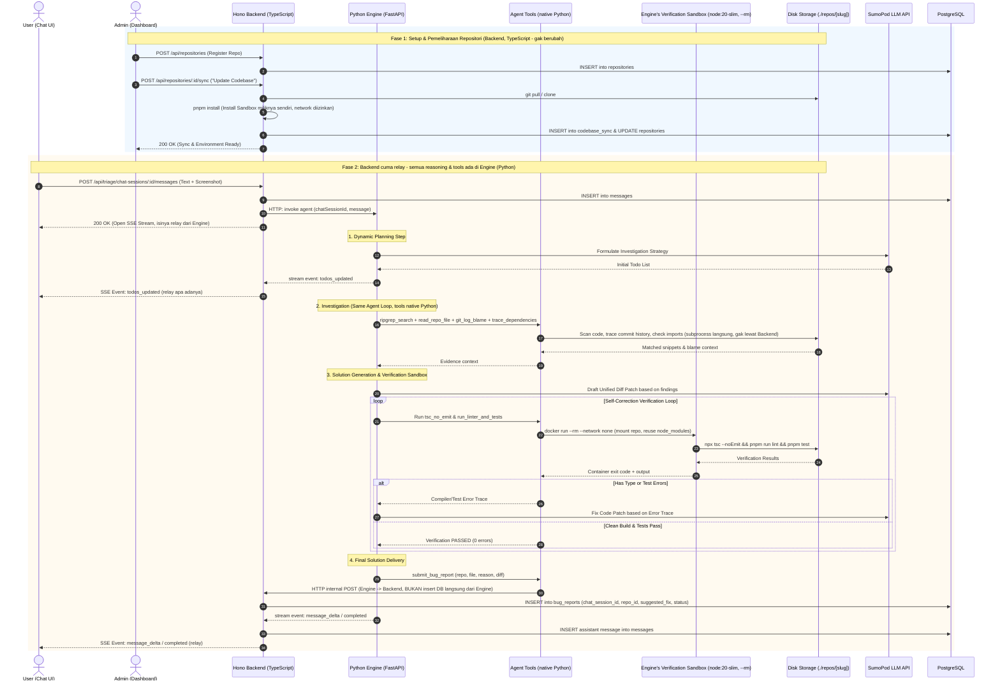

# Business Flow & System Architecture — Smart Bug Triage Deep Agent (Multi-Repo)

## 📌 Gambaran Umum Alur Bisnis (End-to-End Flow)

Sistem ini terdiri dari **3 service**: `frontend` (Next.js), `backend` (Hono/TypeScript), dan `engine`
(Python/FastAPI — **lagi dibangun**, lihat `update.md` buat detail keputusan migrasinya). Frontend cuma
pernah ngomong ke `backend`; `engine` murni internal, dipanggil `backend` buat jalanin agent, dan manggil
balik `backend` lewat 2 endpoint HTTP internal doang (resolve info repo, submit bug report) — gak pernah
lebih dari itu.

Alur kerja terbagi 2 fase utama:

### 1. Fase Setup & Pemeliharaan Repositori (Domain `repository`, di `backend`)
* **Admin** mendaftarkan repositori target (contoh: `frontend`, `backend`, `auth-service`) melalui Dashboard Admin (Nama, Slug, Remote Git URL, Branch, Local Directory Path).
* **Admin** menekan tombol **"Update Codebase & Environment"** (per-repo atau sync-all) untuk memicu proses `git clone` / `git pull` lokal di disk server VPS (`./repos/[slug]`), lalu instalasi dependensi (`pnpm install`) dijalankan **di dalam Docker sandbox** (container sekali-pakai, network diizinkan khusus buat install) - bukan langsung di host - biar postinstall script yang jahat dari repo target gak bisa nyentuh disk server.
* Timestamp `lastSyncedAt` dan log `codebase_sync` dicatat untuk memastikan keterbaruan data kode.
* Fase ini **100% tetap di `backend` (TypeScript)** — gak ada yang pindah ke `engine`.

---

### 2. Fase Analisis Bug & Respon (Backend relay + Engine Deep Agents Harness)

Beda dari desain awal: `backend` **gak lagi jalanin agent-nya sendiri**. `triage.routes.ts` (endpoint SSE)
dan `triage.service.ts` di `backend` cuma nyimpen pesan user, **manggil `engine` lewat HTTP** buat jalanin
agent, terus relay stream balik ke user apa adanya — `backend` gak perlu ngerti struktur state LangGraph
sama sekali. Semua reasoning, ketujuh tools (ripgrep/read-file/git-log-blame/trace-deps/docker-verifikasi),
dan checkpointer-nya sendiri dipegang penuh sama `engine` (Python).

#### Diagram Arsitektur & Alur Kerja (Flowchart)

```mermaid
graph TD
    %% Subgraphs & Layers
    subgraph Frontend["Frontend Layer (Next.js 16 App Router)"]
        UI_User["Chat UI (User)<br/>- Submit Bug & Screenshot<br/>- Receive Realtime SSE Stream<br/>- View Dynamic Todo Progress"]
        UI_Admin["Admin Dashboard<br/>- Repo Management<br/>- Trigger Sync Codebase<br/>- View Verified Bug Reports"]
    end

    subgraph Backend_Repo["Domain: Repository (backend/src/domains/repository) - TypeScript"]
        RepoRoutes["repository.routes.ts<br/>(Admin Role Gated + internal lookup)"]
        RepoService["repository.service.ts"]
        GitEngine["infra/code-search/git.ts<br/>(simple-git)"]
    end

    subgraph InstallSandbox["Install Sandbox (backend/src/infra/verification/sandbox.ts) - TypeScript"]
        DockerRunner["node:20-slim container<br/>--rm, resource-limited<br/>network diizinkan (registry npm)"]
    end

    subgraph Storage_Disk["Server Local Disk (di-share Backend & Engine)"]
        ReposDisk["./repos/[slug]/<br/>Target Repositories Directory"]
    end

    subgraph Backend_Triage["Domain: Triage (backend/src/domains/triage) - TypeScript, thin relay"]
        TriageRoutes["triage.routes.ts<br/>(SSE endpoint - relay only, + internal endpoint submit_bug_report)"]
        TriageService["triage.service.ts<br/>(Chat CRUD, forward invoke ke Engine)"]
    end

    subgraph Engine["Engine (Python/FastAPI) - being built, lihat update.md"]
        Planner["Task Planning (TodoListMiddleware)<br/>- write_todos Tool<br/>- Dynamic Step Progress"]

        subgraph ReActLoop["Autonomous ReAct Tool Loop"]
            MainAgent["Main Triage Agent<br/>(LLM Core, single-agent)"]

            subgraph ToolKit["Agent Toolkit (7 Tools, native Python)"]
                T1["ripgrep_search<br/>(subprocess: rg)"]
                T2["read_repo_file<br/>(pathlib)"]
                T3["git_log_blame<br/>(subprocess: git)"]
                T4["trace_dependencies<br/>(subprocess: rg)"]
                T5["tsc_no_emit ⭐<br/>(Engine's own Docker sandbox)"]
                T6["run_linter_and_tests ⭐<br/>(Engine's own Docker sandbox)"]
                T7["submit_bug_report<br/>(HTTP call ke Backend, bukan DB langsung)"]
            end
        end

        subgraph EngineSandbox["Verification Sandbox (native Python, subprocess ke Docker CLI)"]
            EngineDockerRunner["node:20-slim container<br/>--rm, resource-limited<br/>--network none"]
        end

        EngineCheckpointer["LangGraph Postgres Checkpointer<br/>(satu-satunya DB yang Engine sentuh langsung)"]
    end

    subgraph External_AI["External AI Gateway"]
        SumoPod["SumoPod LLM API<br/>(OpenAI-compatible Chat Completions)"]
    end

    subgraph Database["Database (PostgreSQL)"]
        DB_Repo["repositories & codebase_sync<br/>(Drizzle, dimiliki Backend)"]
        DB_Triage["chat_sessions, messages, bug_reports<br/>(Drizzle, dimiliki Backend)"]
        DB_Checkpointer["LangGraph checkpointer tables<br/>(dimiliki Engine)"]
    end

    %% Relationships - Admin Flow (unchanged, 100% Backend)
    UI_Admin -->|"POST /api/repositories/sync"| RepoRoutes
    RepoRoutes --> RepoService
    RepoService --> GitEngine
    GitEngine -->|"git clone / pull"| ReposDisk
    RepoService -->|"pnpm install (sandboxed)"| DockerRunner
    DockerRunner -->|"network diizinkan buat registry"| ReposDisk
    RepoService -->|"Record lastSyncedAt & Log"| DB_Repo

    %% Relationships - User Flow: Backend cuma relay
    UI_User -->|"POST /api/triage/chat-sessions (SSE)"| TriageRoutes
    TriageRoutes --> TriageService
    TriageService -->|"Simpan user message"| DB_Triage
    TriageService -->|"HTTP: invoke agent"| MainAgent
    MainAgent -.->|"stream shaped events (todos/delta/completed)"| TriageService
    TriageRoutes -.->|"Relay SSE apa adanya"| UI_User

    %% Engine -> Backend: dua HTTP call internal doang
    MainAgent -.->|"HTTP internal: resolve repo slug -> path/metadata"| RepoRoutes
    T7 -.->|"HTTP internal: submit bug report"| TriageRoutes
    TriageRoutes -->|"INSERT bug_reports"| DB_Triage

    %% Deep Agent Executions
    MainAgent <-->|"Generate / Update Todos"| Planner
    MainAgent <-->|"Query AI Gateway"| SumoPod
    MainAgent <-->|"Load/Save Session State"| EngineCheckpointer
    EngineCheckpointer <--> DB_Checkpointer

    %% Tool Executions - langsung dari Engine, gak lewat Backend
    ReActLoop -->|"Execute Search / Read / Blame (subprocess langsung dari Python)"| T1 & T2 & T3 & T4
    T1 & T2 & T3 & T4 --> ReposDisk

    %% Verification Feedback Loop - sandbox milik Engine sendiri
    ReActLoop -->|"Verification Sandbox"| T5 & T6
    T5 & T6 -->|"Run tsc & tests (--network none)"| EngineDockerRunner
    EngineDockerRunner --> ReposDisk
    T5 & T6 -.->|"Return Errors for Auto-Correction"| MainAgent

    %% Output Handlers
    UI_Admin -->|"View Verified Bug Reports"| DB_Triage
```

#### Diagram Urutan Interaksi End-to-End (Sequence Diagram)

---

## 🛠️ Tech Stack & Keputusan Arsitektur

- **3-Service Architecture**: `frontend` (Next.js) ↔ `backend` (Hono/TypeScript) ↔ `engine` (Python/FastAPI,
  **lagi dibangun** — lihat `update.md`). Frontend cuma pernah ngomong ke `backend`; `engine` murni internal,
  gak pernah diakses langsung frontend, dan manggil balik `backend` cuma lewat 2 endpoint HTTP internal
  (resolve info repo, submit bug report).
- **Monorepo Structure**: scaffold "Restack Pattern" — Next.js 16 + Hono + Drizzle ORM + PostgreSQL + Zod
  (`@restack/shared`), pnpm workspaces buat `frontend`/`backend`/`packages/*`. `engine/` jadi folder sibling,
  BUKAN bagian pnpm workspace (dependency management-nya sendiri, Python).
- **Pemisahan Domain (Semi-DDD, di Backend)**:
  - `backend/src/domains/repository/`: aset data repositori (`repositoriesTable`) & log pemeliharaan
    (`codebaseSyncTable`), plus git clone/pull & Docker-sandboxed `pnpm install`.
  - `backend/src/domains/triage/`: sesi percakapan (`chatSessionsTable`, `messagesTable`), draf bug
    terverifikasi (`bugReportsTable`) — sekarang **cuma CRUD + relay SSE**, gak lagi jalanin agent-nya sendiri.
- **Deep Agent Engine (Python, di `engine/`)**:
  - Kerangka agentik **Deep Agents** berbasis LangGraph Python (`create_deep_agent`).
  - **TodoListMiddleware**: real-time progress updates (To-Do List) ke pengguna via SSE (di-relay lewat Backend).
  - **Single-Agent ReAct Loop**: satu agent utama pegang seluruh 7 tools (investigasi + verifikasi) dalam
    satu loop, tanpa delegasi ke sub-agent terpisah — keputusan ini gak berubah dari versi TypeScript-nya.
  - **Postgres Checkpointer milik Engine sendiri**: state percakapan per `chatSessionId`, di tabel Postgres
    yang TERPISAH dari tabel yang dikelola Drizzle-nya Backend.
- **7 Agent Tools, native Python** (semua reimplement pakai `subprocess`/`pathlib`, bukan lagi TypeScript):
  1. `ripgrep_search`: subprocess ke binary `rg`.
  2. `read_repo_file`: `pathlib`/`open()`, dengan guard path-traversal yang sama persis kayak versi TS-nya.
  3. `git_log_blame`: subprocess ke `git log`/`git blame --line-porcelain -- <path>` (`--` separator tetap dipertahankan).
  4. `trace_dependencies`: reuse logic `ripgrep_search`.
  5. `tsc_no_emit` ⭐: jalan di Docker sandbox milik Engine sendiri.
  6. `run_linter_and_tests` ⭐: jalan di Docker sandbox milik Engine sendiri.
  7. `submit_bug_report`: **HTTP call ke Backend** (bukan tulis DB langsung) — Engine gak pernah nyentuh
     tabel yang dikelola Drizzle sama sekali.
- **Dua Docker Sandbox terpisah** (dua bahasa berbeda, satu Docker daemon yang sama):
  - **Install Sandbox** (`backend/src/infra/verification/sandbox.ts`, TypeScript, **tetap ada** — dipicu
    admin pas sync repo) — `pnpm install`, network diizinkan (wajib buat registry npm).
  - **Verification Sandbox** (di `engine/`, Python, **baru**) — `tsc_no_emit`/`run_linter_and_tests` pas
    triage, `--network none` + resource limit (`--memory`/`--cpus`/`--pids-limit`). Security properti-nya
    diporting persis sama kayak versi TS: path boundary check, `--` separator di git blame, dll — cuma
    bahasa implementasinya yang beda.
  - `./repos/[slug]/` tetap satu folder biasa di disk yang di-share Backend & Engine (bukan Docker volume) —
    cuma eksekusi kode-nya yang dikontainerisasi, git clone/pull tetap jalan langsung di host.
- **Verification & Self-Correction Feedback Loop**: AI Agent (sekarang di Engine) gak pasif nyerahin saran
  kode — dia eksekusi compiler/test runner di Docker sandbox miliknya sendiri, baca stack trace error, dan
  merevisi kode sampai bersih sebelum ditampilkan ke pengguna.
- **Real-Time Streaming**: Backend expose SSE ke frontend, tapi isinya di-relay dari stream HTTP internal
  yang dikirim balik Engine — Backend gak perlu ngerti struktur state LangGraph sama sekali, cukup forward
  event yang udah di-shape Engine (`todos_updated`/`message_delta`/`completed`).
- **LLM Gateway Provider**: [SumoPod](https://sumopod.com) (`https://ai.sumopod.com/v1`), dipanggil dari
  `engine` (Python) pakai `langchain-openai`'s `ChatOpenAI` versi Python — provider-agnostic sama kayak versi
  TS-nya (ganti provider tinggal ganti env var, gak ada perubahan kode).
- **Role & Access Control**: Pengguna 2 level akses: `user` (chat bug report) & `admin` (manajemen repo &
  dashboard) — auth tetap 100% ditangani `backend`. `engine` gak pernah verifikasi JWT sendiri; dia dipercaya
  penuh lewat network internal karena gak pernah diakses langsung dari frontend.
